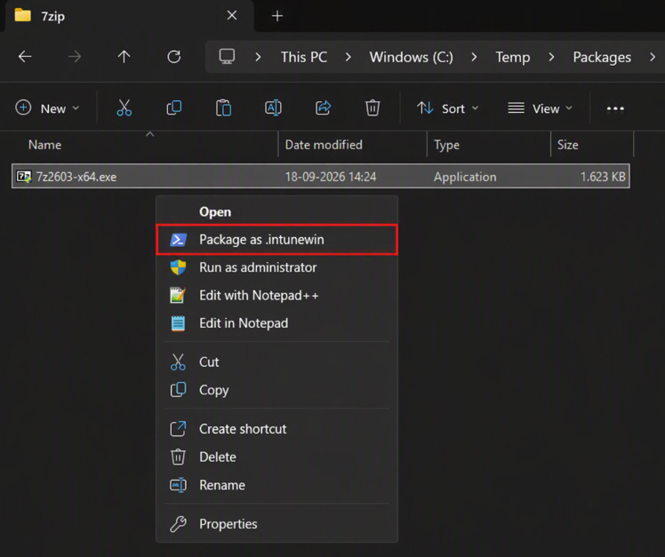
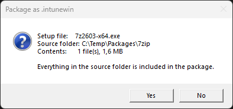
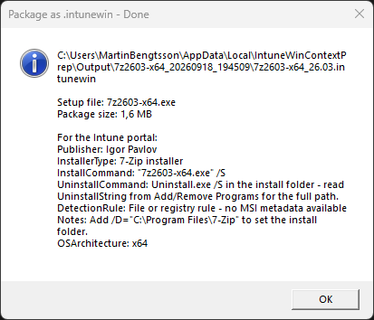

# IntuneWin ContextPrep

Adds a **Package as .intunewin** entry to the Windows Explorer context menu. Right-click a setup
file or a folder and get a finished `.intunewin` package, without opening a console and typing out
`-c`, `-s` and `-o` paths for IntuneWinAppUtil.exe.

The Microsoft [Win32 Content Prep Tool](https://github.com/microsoft/Microsoft-Win32-Content-Prep-Tool)
does the packaging. This project handles everything around it: locating the source folder, picking
the setup file, warning about what will be included in the package, and reading the result back so
you know what to type into the Intune portal afterwards.



## What it adds on top of IntuneWinAppUtil.exe

- **Paths resolved from what you clicked.** Right-click a setup file and its parent folder becomes
  the source. Right-click a folder and it is used directly. If it holds several setup files you pick
  one, and the choice is remembered per folder, so the next version is one click.
- **A confirmation before anything is packaged.** Everything in the source folder goes into the
  package, so the prompt shows the file count and size, flags personal and system folders, calls out
  existing `.intunewin` files, and warns past the 30 GB limit Intune enforces.
- **A path length pre-check.** Deeply nested source files fail inside the packaging tool. You are
  told up front rather than halfway through.
- **Output kept away from the source.** Packages land under
  `%LOCALAPPDATA%\IntuneWinContextPrep\Output`, so a re-run never wraps the previous package into
  the next one.
- **Version in the filename.** `remotehelpinstaller_5.2.1040.0.intunewin`, from the MSI product
  version or the exe's version resource.
- **Portal handoff.** A `.json` file next to the package with the publisher, install and uninstall
  commands, and a detection rule. For an MSI that carries the product code and product version.
- **Architecture for the requirement rule.** Read from the installer itself and reported as what to
  select under **Operating system architecture**. A 32-bit installer reports `x86, x64`.
- **Silent switches for exe installers.** The wrapper identifies which installer built the exe
  and reports the switches that installer documents.

| Detected as | Install command | Uninstall |
| --- | --- | --- |
| WiX Burn bundle | `/quiet /norestart` | `/uninstall /quiet /norestart` |
| NSIS | `/S` (case sensitive) | `Uninstall.exe /S`, path from `QuietUninstallString` |
| Inno Setup | `/VERYSILENT /SUPPRESSMSGBOXES /NORESTART` | `unins000.exe` with the same switches |
| InstallShield | `/s /v"/qn"` | From `UninstallString` |
| 7-Zip installer | `/S` | `Uninstall.exe /S`, path from `UninstallString` |
| MSI | `msiexec /i "<file>" /qn` | `msiexec /x <ProductCode> /qn` |
| Unknown | File name only | Check after a test install |

Vendor-specific installers are added as they come up.

## Requirements

- Windows PowerShell 5.1
- .NET Framework 4.7.2 or later, which IntuneWinAppUtil.exe depends on. The installer checks this
  and stops if it is missing.
- Local administrator rights for a per-machine install. Not needed for a per-user install.

## Install

```powershell
.\Install-IntuneWinContextPrep.ps1
```

Elevated, this installs per machine to `%ProgramFiles%\IntuneWinContextPrep` and registers the menu
entry in `HKLM`. Without elevation it installs per user to `%LOCALAPPDATA%\IntuneWinContextPrep` and
`HKCU`. Force either with `-Scope Machine` or `-Scope User`.

Machine scope is the better default: the files Explorer executes stay writable only by
administrators.

The installer downloads IntuneWinAppUtil.exe, verifies it, copies it and both scripts into the
install folder, and adds the menu entry for `.exe`, `.msi`, `.msp`, folders, and the background of
an open folder.

### Where IntuneWinAppUtil.exe comes from

Microsoft publishes the file in their repository's source tree rather than as a release download,
and has swapped it for a different build without changing the version number. The installer
therefore pulls a specific tagged version, `v1.8.7` by default, and refuses to install it unless
Windows confirms it is signed by Microsoft.

If downloading is blocked in your environment, install from a copy you have already approved. It
gets the same checks:

```powershell
.\Install-IntuneWinContextPrep.ps1 -ToolPath 'C:\Approved\IntuneWinAppUtil.exe'
```

Use `-ToolVersionTag` for a different tag, or `-ExpectedHash` to pin one exact build.

## Use it

Right-click any of the following and choose **Package as .intunewin**. On Windows 11 it sits under
**Show more options**.

- an `.exe`, `.msi` or `.msp` file
- a folder containing one
- the empty background of an open folder

Confirm what is about to be packaged:



Explorer opens the output folder when it finishes, and the result is reported with the values the
portal asks for next:



The same values are written to a `.json` file next to the package:

```json
{
    "Package":  "C:\\Users\\<you>\\AppData\\Local\\IntuneWinContextPrep\\Output\\7z2603-x64_20260918_162715\\7z2603-x64_26.03.intunewin",
    "SetupFile":  "7z2603-x64.exe",
    "Publisher":  "Igor Pavlov",
    "InstallerType":  "7-Zip installer",
    "InstallCommand":  "7z2603-x64.exe /S",
    "UninstallCommand":  "Uninstall.exe /S in the install folder - read UninstallString from Add/Remove Programs for the full path.",
    "DetectionRule":  "File or registry rule - no MSI metadata available",
    "Notes":  "Add /D=\"C:\\Program Files\\7-Zip\" to set the install folder.",
    "OSArchitecture":  "x64"
}
```

The setup file is quoted only when its name contains a space, so the commands can be copied straight
out of the file.

## Output

Everything is written under `%LOCALAPPDATA%\IntuneWinContextPrep`, under both install scopes, because
`%ProgramFiles%` is not writable at packaging time.

| Path | Contents |
| --- | --- |
| `Output\<setup>_<timestamp>\` | The `.intunewin` package and its `.json` handoff file |
| `Logs\` | A log per run, plus the packaging tool's own output |
| `setup-choices.json` | Remembered setup file per source folder |

## AppLocker and App Control

Under an application control policy that does not trust these scripts, PowerShell runs restricted
and neither script can do its job. Since Explorer runs the wrapper with no visible window, that
would otherwise look like nothing happened, so both scripts check for this first and report the
reason - the wrapper by writing it to its log.

Sign `Invoke-IntuneWinContextPrep.ps1` and allow the signer in your policy. If the installed wrapper
is signed, the installer registers the menu entry with `-ExecutionPolicy AllSigned`, so a tampered
copy refuses to run. Unsigned, it falls back to `-ExecutionPolicy Bypass` and warns you.

## Uninstall

```powershell
.\Install-IntuneWinContextPrep.ps1 -Action Uninstall
```

This clears both `HKCU` and `HKLM`, so a per-user and a per-machine install are removed in one pass.
Clearing `HKLM` needs elevation; without it the per-machine entry is left in place and a warning is
written.

The install folder, the packaging tool, the logs and every package generated so far are left alone
unless you ask for them:

```powershell
.\Install-IntuneWinContextPrep.ps1 -Action Uninstall -RemoveFiles
```

## Parameters

`Get-Help .\Install-IntuneWinContextPrep.ps1 -Full` documents every parameter, including scope,
install path, tool version tag and hash pinning.

## Known limits

- One item at a time. Select several files and the entry handles only the first one. This is
  deliberate: Explorer otherwise starts a separate hidden run for every file selected, and stops
  showing the entry at all past 15 of them.
- No submenu. Submenus defined in the registry do not appear in current Explorer builds, at top
  level or under **Show more options**, so each file type gets one flat entry.
- Detection rules and commands in the handoff JSON are suggestions read from package metadata and
  installer fingerprints. Check them against vendor documentation before deploying.

## Author

Martin Bengtsson
Blog: [www.imab.dk](https://www.imab.dk)
X: [@mwbengtsson](https://x.com/mwbengtsson)
